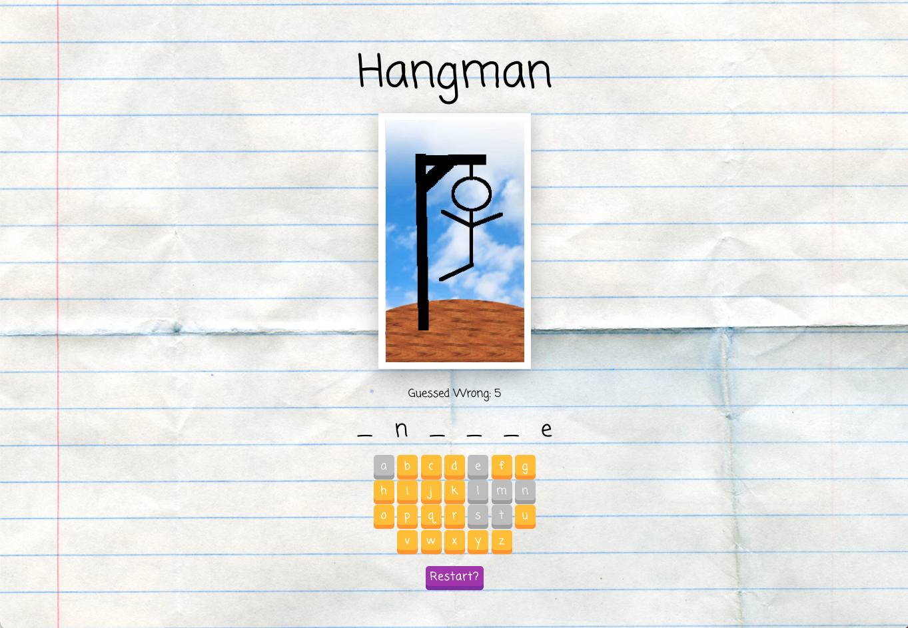

# Hangman

This project was made based on starter code from Colt Steele's Udemy course [The Modern React Bootcamp](https://www.udemy.com/course/modern-react-bootcamp/). It is a simple Hangman game built in React. Users can guess words letter by letter, and have the ability to reset the game with a new word at any time.

## Future Development

The game could use a counter for displaying how many games have been won or lost in a row. Users could also be able to change the difficulty by increasing the number of allowed wrong guesses.

## Run the App

`npm start`

Runs the app in the development mode.\
Open [http://localhost:3000](http://localhost:3000) to view it in your browser.